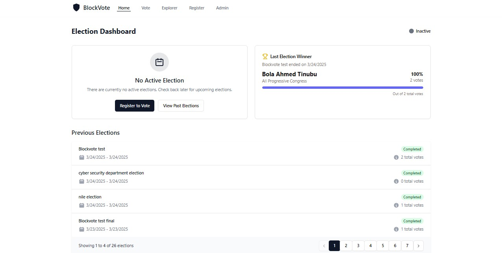

# BlockVote - Blockchain Voting Platform


BlockVote is a secure, transparent and user-friendly blockchain-based voting platform built on the Polygon Amoy testnet. It enables trustworthy election management with complete transparency and verifiability.

## Features

- **Secure Blockchain Voting**: Cast votes securely on the Polygon Amoy testnet blockchain
- **National ID Verification**: Integration with National ID verification system
- **Transparent Election Process**: All votes are verifiable on the blockchain
- **Real-time Results**: Track election results as they happen
- **Admin Dashboard**: Create and manage elections with ease
- **Blockchain Explorer**: Browse and verify transactions on the blockchain
- **Responsive Design**: Works seamlessly on mobile, tablet, and desktop devices
- **Dark/Light Mode**: Choose your preferred theme

## Technology Stack

- **Frontend**: React.js, TypeScript, Tailwind CSS, Shadcn/UI
- **State Management**: React Context API, TanStack Query
- **Blockchain**: Polygon Amoy Testnet
- **Smart Contracts**: Solidity
- **Web3 Integration**: ethers.js, web3.js
- **Wallet Integration**: MetaMask, Phantom
- **Database**: Supabase
- **API**: Express.js
- **Deployment**: Vercel

## Getting Started

### Prerequisites

- Node.js 18.x or later
- npm or yarn
- MetaMask browser extension (for voting and admin functions)
- Supabase account (for database services)

### Installation

1. Clone the repository:
```bash
git clone https://github.com/yourusername/blockvote.git
cd blockvote
```

2. Install dependencies:
```bash
npm install
```

3. Set up environment variables:
Create a `.env.local` file in the root directory with the following variables:
```
VITE_SUPABASE_URL=your_supabase_url
VITE_SUPABASE_ANON_KEY=your_supabase_anon_key
VITE_CONTRACT_ADDRESS=your_contract_address
VITE_ALCHEMY_URL=your_alchemy_url
DATABASE_URL=your_database_url
```

4. Start the development server:
```bash
npm run dev
```

The application will be available at http://localhost:5000

### Building for Production

To build the application for production:

```bash
npm run build
```

### Deployment on Vercel

The application is configured for seamless deployment on Vercel:

1. Connect your GitHub repository to Vercel
2. Configure the required environment variables in your Vercel project settings
3. Deploy the project

## Project Structure

```
├── api/                  # Serverless API functions for Vercel
├── client/               # Frontend React application
│   ├── src/
│   │   ├── components/   # Reusable UI components
│   │   ├── hooks/        # Custom React hooks
│   │   ├── lib/          # Utility functions and libraries
│   │   ├── pages/        # Application pages
│   │   ├── utils/        # Helper functions
│   │   ├── App.tsx       # Main application component
│   │   └── main.tsx      # Application entry point
├── contracts/            # Smart contract ABIs
├── server/               # Express backend server
│   ├── index.ts          # Server entry point
│   ├── routes.ts         # API routes
│   └── storage.ts        # Data storage interfaces
├── shared/               # Shared code between client and server
└── utils/                # Utility functions
```

## Smart Contracts

The voting system uses a custom smart contract deployed on the Polygon Amoy testnet. The contract handles:

- Election creation and management
- Secure vote casting with duplicate prevention
- Vote tallying and result verification
- Admin role management

## Contributing

Contributions are welcome! Please feel free to submit a Pull Request.

1. Fork the repository
2. Create your feature branch (`git checkout -b feature/amazing-feature`)
3. Commit your changes (`git commit -m 'Add some amazing feature'`)
4. Push to the branch (`git push origin feature/amazing-feature`)
5. Open a Pull Request

## License

This project is licensed under the MIT License - see the LICENSE file for details.

## Contact

For questions, support, or feedback, please open an issue in the GitHub repository.

---

© 2025 BlockVote. All rights reserved.
"# newnew" 
"# newnew" 
"# newnew" 
