# Diagrams for Chapter 4: Design and Implementation

## 1. System Architecture Design

### 1.1 Architecture Overview
*Reference: Chapter 4, Section 1.1 Architecture Overview*

### 1.3 Data Flow
*Reference: Chapter 4, Section 1.3 Data Flow*

## 2. Implementation of Key Features

### 2.1 Voter Registration - Registration Flow
*Reference: Chapter 4, Section 2.1 Voter Registration - Registration Flow*

### 2.1 Voter Registration - Security Measures
*Reference: Chapter 4, Section 2.1 Voter Registration - Security Measures*

### 2.2 Ballot Casting - Vote Casting Flow
*Reference: Chapter 4, Section 2.2 Ballot Casting - Vote Casting Flow*

### 2.2 Ballot Casting - Blockchain Vote Recording Mechanism
*Reference: Chapter 4, Section 2.2 Ballot Casting - Blockchain Vote Recording Mechanism*

### 2.2 Ballot Casting - Anonymity and Privacy Mechanisms
*Reference: Chapter 4, Section 2.2 Ballot Casting - Anonymity and Privacy Mechanisms*

## 3. Smart Contract Development

### 3.1 Smart Contract Structure
*Reference: Chapter 4, Section 3.1 Smart Contract Structure*

```mermaid
classDiagram
    class VotingSystem {
        +address admin
        +uint256 activeElectionId
        +uint256 electionCount
        +mapping(uint256 => Election) elections
        +constructor()
        +createElection(name, startTime, endTime, candidateNames, candidateParties) uint256
        +activateElection(electionId) void
        +castVote(electionId, candidateId, voterHash) void
        +changeAdmin(newAdmin) void
        +getElectionInfo(electionId) tuple
        +getCandidate(electionId, candidateId) tuple
        +hasVoted(electionId, voterHash) bool
        +getActiveElectionId() uint256
    }
    
    class Election {
        +string name
        +uint256 startTime
        +uint256 endTime
        +bool active
        +uint256 candidateCount
        +mapping(uint256 => Candidate) candidates
        +mapping(bytes32 => bool) hasVoted
    }
    
    class Candidate {
        +string name
        +string party
        +uint256 votes
    }
    
    class Events {
        +ElectionCreated(electionId, name)
        +VoteCast(electionId, candidateId)
        +AdminChanged(oldAdmin, newAdmin)
    }
    
    VotingSystem "1" -- "many" Election : manages
    Election "1" -- "many" Candidate : contains
    VotingSystem -- Events : emits
```

## 4. User Interface Design

### 4.1 User Interface Wireframes - Voter Registration Page
*Reference: Chapter 4, Section 4.1 User Interface Wireframes - Voter Registration Page*

### 4.1 User Interface Wireframes - Voting Page
*Reference: Chapter 4, Section 4.1 User Interface Wireframes - Voting Page*

### 4.1 User Interface Wireframes - Admin Dashboard
*Reference: Chapter 4, Section 4.1 User Interface Wireframes - Admin Dashboard*

### 4.2 User Interface Implementation - Voting Interface Architecture
*Reference: Chapter 4, Section 4.2 User Interface Implementation - Voting Interface Architecture*

### 4.2 User Interface Implementation - Admin Interface Architecture
*Reference: Chapter 4, Section 4.2 User Interface Implementation - Admin Interface Architecture*

## 5. Testing Phase

### 5.1 Testing Approach
*Reference: Chapter 4, Section 5.1 Testing Approach*

### 5.2 Unit Testing
*Reference: Chapter 4, Section 5.2 Unit Testing*

### 5.3 Integration Testing
*Reference: Chapter 4, Section 5.3 Integration Testing*

### 5.4 End-to-End Testing
*Reference: Chapter 4, Section 5.4 End-to-End Testing*

## 6. Deployment Strategy

### 6.1 Deployment Process
*Reference: Chapter 4, Section 6.1 Deployment Process*

### 6.2 Deployment Architecture
*Reference: Chapter 4, Section 6.2 Deployment Architecture*

